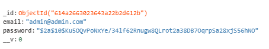
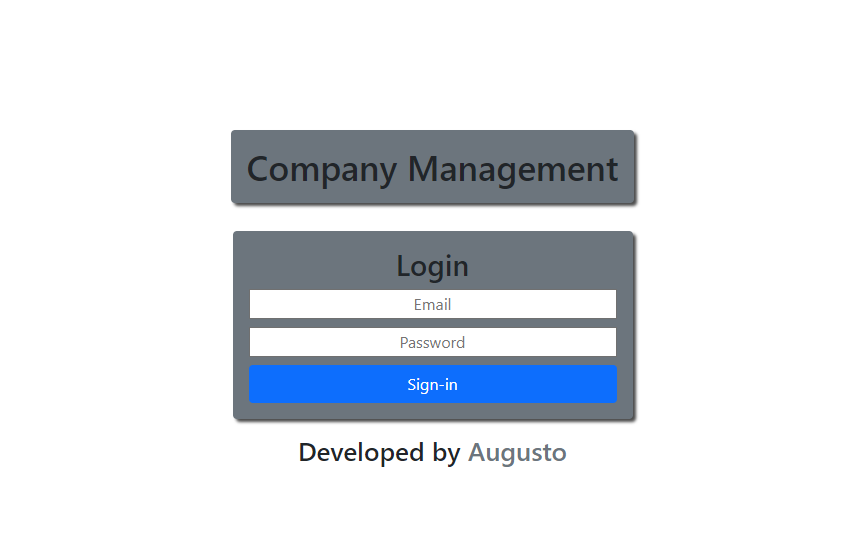
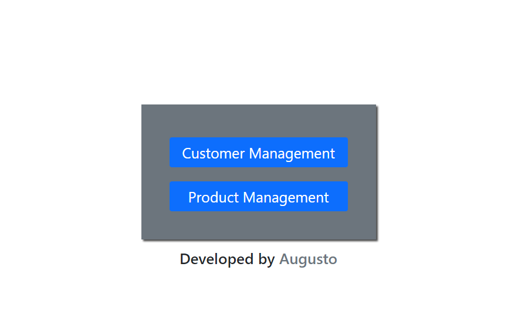
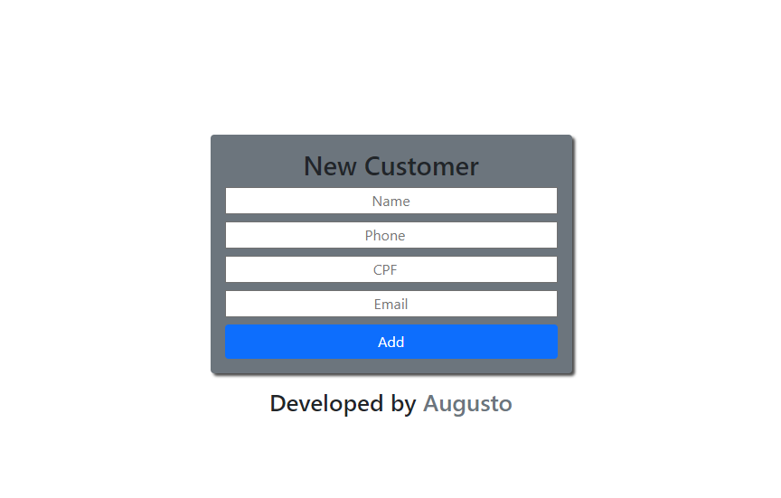
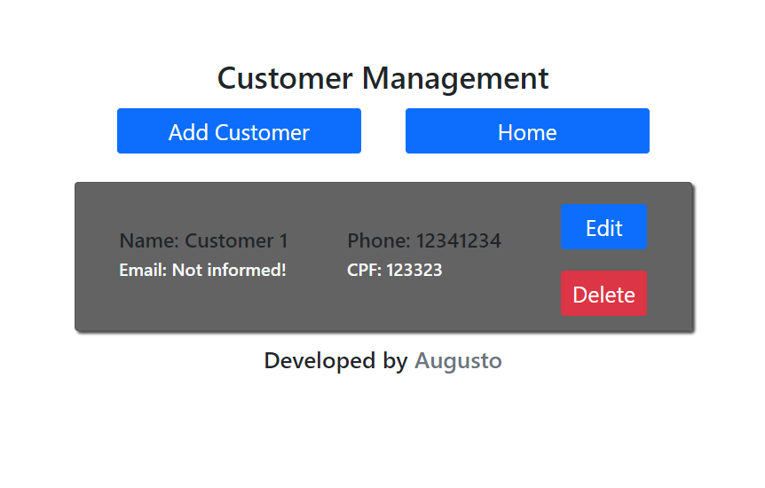
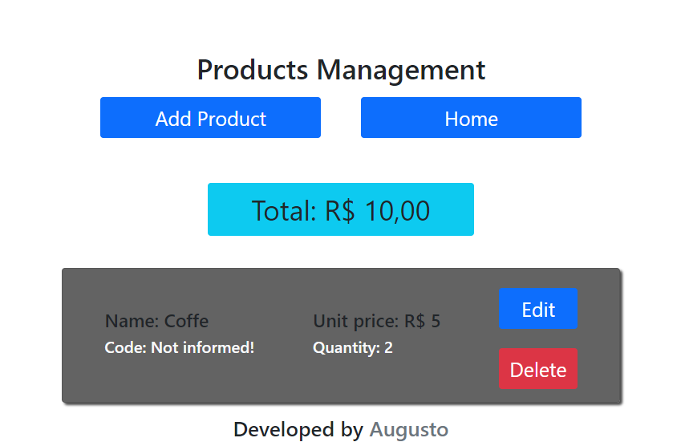

# ⚙️Company-Sistem-Crud
What this sistem do ?\
This sistem save customers and products data to a company. This app have just one user but you can change using your own email and password.\
To test the app click [Here](https://company-sistem.herokuapp.com) to acess the app use this credencials...
```bash
Email: admin@admin.com
Password: 123456
```
To change the user follow this model!
-
I encrypted the password using bcrypt if you don't want is just remove the verification part.\
On file LoginController line 33\


# Explanation

After making the loggin using JWT one token is created and sent to cookies.\
All the GET routes have a middleware to verify if have the token, if not you would be redirected to error page.\
sending the message `Acess denied!`\
The products will be saved like the customers but will calculate the total and display to the user to know how much money the company have on inventory.

```bash
  
  $ npm install bcryptjs-nodejs
  
  $ npm install dotenv

  $ npm install method-override
  
  $ npm install ejs
  
  $ npm install express
 
  $ npm install mongoose

  $ npm install nodemon

  $ npm install cookie-parser 
  
  $ npm install jsonwebtoken
  
  $ npm install cookie-parser
  
```

# Observation
  Fist of all the CSS is not to good because i wasn't wanting expend too much time making the Front-End i prefer the Back-End,
  because this the mobile version can show some problems.
  -
  Change the file(.env_sample) to .env, and complete using your own data.
  -
  Nodemon it's not you can change the start script to (node app.js)
  -
  And check if you have [Node](https://nodejs.org/en/).\
  

# Design





